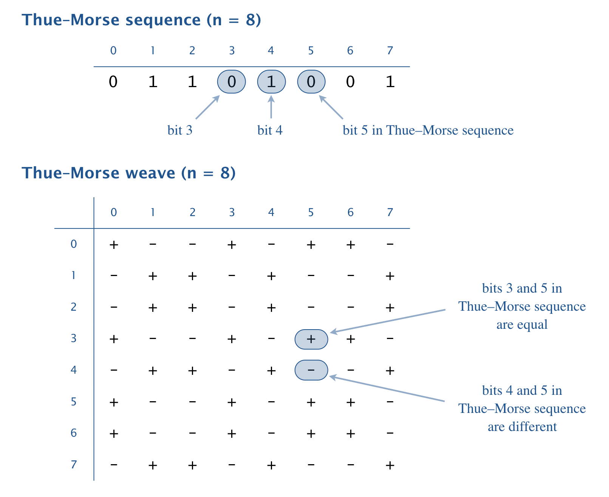

# Thue-Morse Weave Generator

This Java program generates n×n patterns based on the fascinating Thue-Morse sequence, a mathematical sequence with applications in art, music, and computer science.

## About the Thue-Morse Sequence

The Thue-Morse sequence is an infinite binary sequence constructed by:
1. Starting with 0
2. Repeatedly appending the bitwise negation of the current sequence

First few iterations:
```
0
01
0110
01101001
0110100110010110
```

## Program Usage

Compile and run the program with:
```bash
javac ThueMorse.java
java ThueMorse n
```
Where `n` is the size of the pattern (positive integer, doesn't need to be power of 2)

## Example Outputs

### 4×4 Pattern
```bash
~/Desktop/arrays> java ThueMorse 4
+  -  -  +  
-  +  +  -  
-  +  +  -  
+  -  -  +  
```

### 8×8 Pattern
```bash
~/Desktop/arrays> java ThueMorse 8
+  -  -  +  -  +  +  -  
-  +  +  -  +  -  -  +  
-  +  +  -  +  -  -  +  
+  -  -  +  -  +  +  -  
-  +  +  -  +  -  -  +  
+  -  -  +  -  +  +  -  
+  -  -  +  -  +  +  -  
-  +  +  -  +  -  -  +  
```

## Visual Example




## How It Works

The program:
1. Generates the Thue-Morse sequence up to the required length
2. For each cell (i,j) in the n×n grid:
   - Compares the i-th and j-th bits in the sequence
   - Prints `+` if bits are equal, `-` if different
3. Maintains consistent two-space separation between symbols

## Applications

The Thue-Morse sequence and its visual patterns have surprising applications in:
- Graphic design and weaving patterns
- Music composition
- Fractal generation
- Computer science (particularly in combinatorics)

## Implementation Features

- Efficient sequence generation without recursion
- Clean grid formatting with proper spacing
- Handles any positive integer n (not just powers of 2)
- Demonstrates bitwise operations and sequence manipulation

## License

This project is open-source under the [MIT License](LICENSE).
